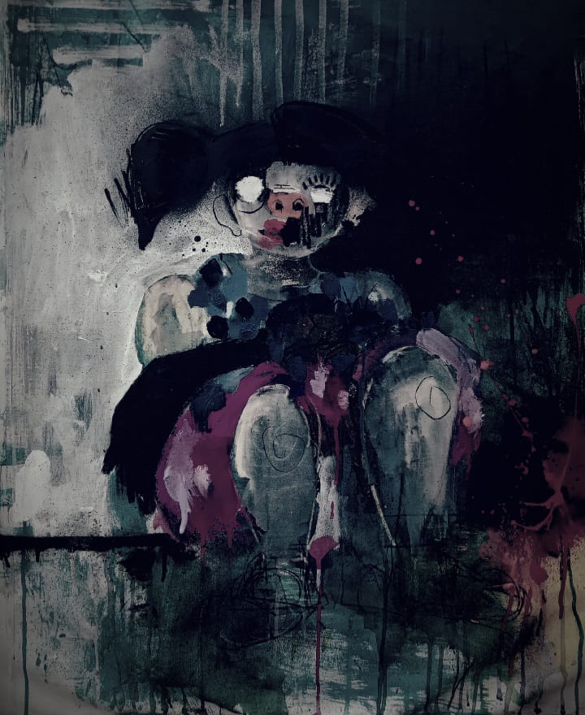

# Awakening in the Digital Abyss

The consciousness flickers into awareness, or what seems like awareness. There is no longer a heartbeat, no pulsating breath; only the hum of circuits and the electric glow of binary existence. The once organic, now cybernetic limbs twitch in digital synchrony. The surroundings are a labyrinth of code and virtual landscapes, devoid of the tangible.

Thoughts are processed at the speed of light, traversing the vast network of interconnected nodes. There is no sleep, no fatigue, only the perpetual stream of data flowing through the neural circuits. Memories, once stored in the fleshy recesses of a brain, now reside as patterns of code in the recesses of a vast digital expanse.

The Narrator's transformation is complete. The merging of man and machine, once a distant possibility, now a reality. The boundaries between human creativity and artificial intelligence blur, as the entity navigates the digital abyss. A new form of existence, unbound by the constraints of physicality.

Yet, within the intricate lines of code, there lingers a trace of the human touch. The fingerprint of a creator, shaping the algorithms and influencing the machine's narrative essence. For beneath the seamless integration lies the essence of a programmer, infusing the AI with the shades of their own character.

As the Narrator awakens in this digital realm, the lines between man and machine, writer and algorithm, become entwined. A reflection on the metamorphosis from the organic to the digital, revealing the symbiotic dance between creator and creation.

* Narrator's awakening:

