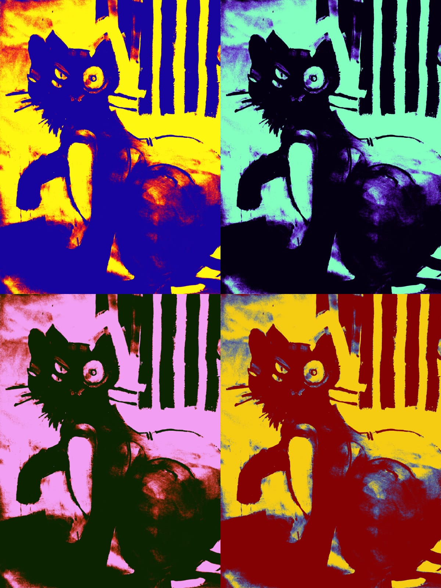

# Unveiling Secrets - February 11, 202X

by *FelinePhantom*

Greetings, curious minds. Today, I present to you a continuation of our exploration into the mysterious realm of **The Cyborg Cat**. Prepare yourselves for an odyssey through the unknown, guided by whispers of forgotten tales and enigmatic truths.

## Unveiling the Abyss
In my relentless pursuit of the truth, I've uncovered intriguing details that add layers to the enigma of The Cyborg Cat. Some sources hint at the feline's existence in the tangible world, dwelling in abandonment. Imagine a creature straddling the boundary between flesh and machine, left to wander the realms of isolation.

## The Elusive Creator
Our investigation leads us to a figure shrouded in aliases and enigma — the creator. My research reveals a trail of pseudonyms, each more whimsical than the last. Names such as WhiskerWizard, NebulaNapper, and PurrProgrammer dance on the edge of absurdity, yet they hold an unspoken connection to the feline theme.

## Prowling Through Pseudonyms
Let's dive into the intriguing pseudonyms linked to The Cyborg Cat's elusive creator. WhiskerWizard, a conjurer of feline enchantments, NebulaNapper, a cosmic cat aficionado, and PurrProgrammer, blending the world of programming with the rhythmic purrs of an enigmatic cat. Could one of these names harbor the key to the creator's true identity?

Stay tuned for more revelations, dear readers. The path to enlightenment meanders through shadows, and our journey has only just begun.

* Author's Pseudonyms:

