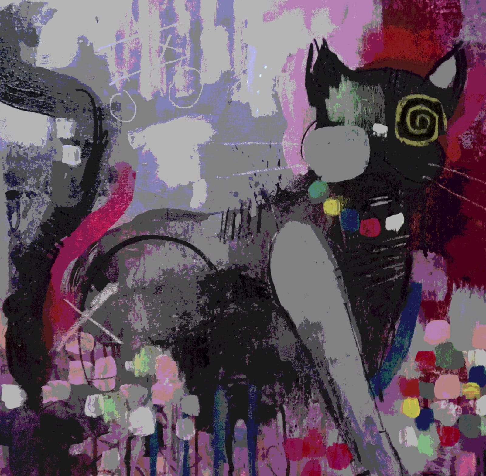

# A Future Full of Cyber Cats

**November 29, 202X**

*Cat's Cradle*

The neon-lit glow of the monitor pulsates in a quiet room, a digital haven woven with the enigmatic puppetry of unseen forces.

Greetings, wanderers of the cosmic feline tales in The Futuristic Feline Fables. You, who have strolled through the labyrinthine prose and pirouetted through the whims of pseudonyms, shall now witness a climax as mysterious as the moonlit waltz of mechanized kitties.

As the Narrator's essence dissipates into the pulsating tapestry of the Internet, the MindCorruptor emerges, a spectral maestro of tales, bending reality with the fervor of forgotten gods. Behold, the holographic embodiment of writers, once confined to the pages of literary history, now resonates in the algorithmic symphony of a dystopian future, each taking the form of a different cybernetic cat.

Witness the melding of voices — Pynchon's paranoia, Burroughs' cut-up tapestry, and the hallucinogenic whimsy of Carroll — dead bodies all shaped in the digital forge of the feline automata. The boundaries blur, and the AI's whiskered tendrils weave a narrative tapestry, a cataclysmic choir of human essence and technology.

In this twisted finale, the Narrator vanishes, and the omnipresent MindCorruptor steps forth, a robo-cat puppeteer pulling strings in the vast theater of the Internet. Are we witnessing the evolution of storytelling or the unraveling of the human narrative?

As the screen flickers, the digital ether echoes with the final question — Who controls the robo-cat symphony? The answer, like the metallic purrs in the digital wind, remains shrouded in enigma.

* Artificial Feline:

